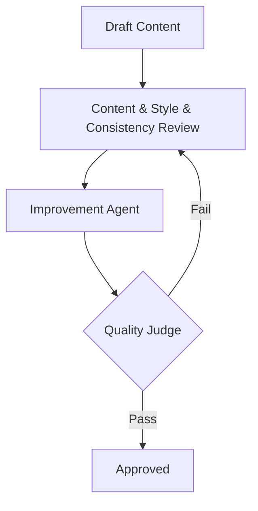

# Architecture

## Overview
The system is built as a modular multi-agent framework designed to process and improve content.

## Component Design

### Base Agent
The `BaseAgent` (`src/govuk_content_agents/agents/base.py`) is the foundation for all specialized agents. It handles:

*   **Multi-Provider Support**:
    *   **OpenAI**: Default. Uses `gpt-4.1-mini` (or other `gpt-*` models) for high-reliability execution.
    *   **Google Gemini**: Fallback. Uses `gemini-2.0-flash` with built-in retry logic to handle free-tier rate limits (`429` errors).
*   **Abstraction**: Provides a common `execute()` interface regardless of the underlying LLM.
*   **Response Parsing**: Automatically parses JSON responses from the LLMs into structured objects.

### Content Reviewer Agent
The first implemented agent uses the `BaseAgent` to analyze content against specific GOV.UK style guidelines.
*   **Input**: Raw text content.
*   **Output**: Structured feedback with a score, summary, and list of issues (severity, description, suggestion).

### Additional Agents (Stage 2)
*   **Style Compliance Check**: Regex and rule-based checks for GOV.UK style.
*   **Consistency Check**: Semantic search against `postgres` vector database.
*   **Improvement Agent**: LLM-based rewriter.
*   **Quality Judge**: LLM-as-a-Judge for final scoring.

## Orchestration (Stage 2)
We use **LangGraph** to coordinate the agents in a feedback loop.

## Data Storage
*   **MongoDB**: Stores agent execution logs, review sessions, and raw feedback.
*   **PostgreSQL (pgvector)**: Stores content embeddings for semantic search and retrieval (RAG).
